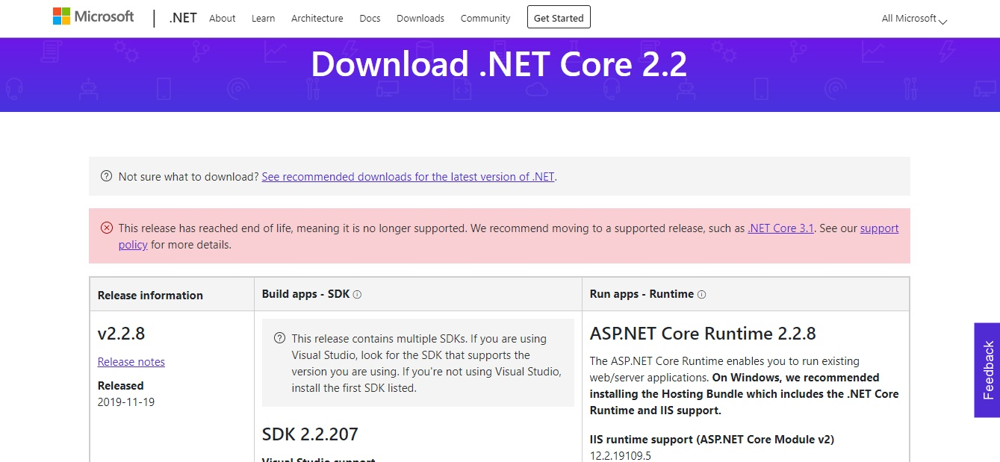
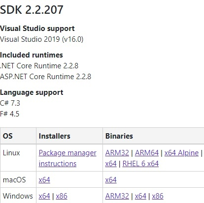
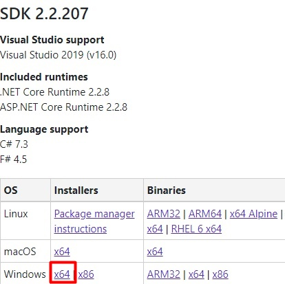
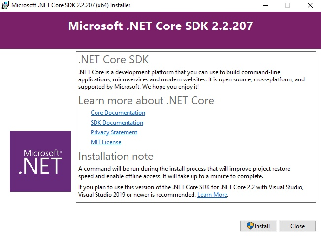
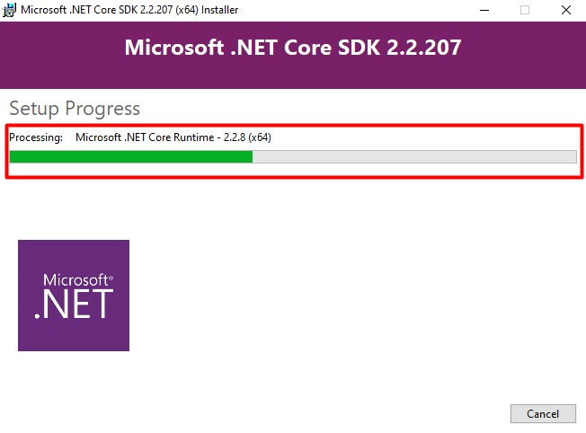
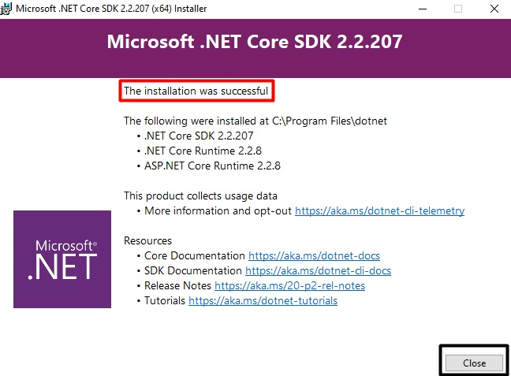

# **Ejercicio de Markdown en Github**

Datos del creador: López Rivera Vanessa Elizabeth

## Instalación de dotnet core 2.2.

**1.** Para la instalación de dotnet core 2.2 debes de dirigirte al siguiente link para poder dar inicio con la descarga. 

Link a la página de descarga: [Download](https://dotnet.microsoft.com/download/dotnet-core/2.2) 

Cuando ingreses a la página podrás visualizar algo como lo siguiente:

**2.** Una vez en el sitio podremos ver las siguientes opciones de descarga

En este caso descargaremos el marcado como Windows x64 por el tipo de computadora que se esta usando en el tutorial. Asi que lo seleccionaremos

**Nota:** Es impotante bajar el SDK, por que **vamos a programar**. 

**3.** Al dar inicio con la descarga nos aparecerá un cuadro similar al siguiente, el cual nos idicará que se ha dado inicio con la descarga.

**4.** Una vez finalizada la descarga continuaremos dando click en el recuadro. Nos aparecerá el siguiente cuadro de instalación.

Daremos click en donde dice **Install**

**5.** Aparecerá una barra de progreso como se muestra en la imagen. Habrá que esperar a que termine el progreso.

**6.** Una vez finalizada la instalación aparecerá lo siguiente.

Lo subrayado en rojo nos dice que la instalación ha sido exitosa asi que por último daremos click en **Close** para cerrar el cuadro, y con ello abremos finalizado la instalación del dotnet core 2.2

## Instalación y configuración de Visual Studio Code para C#.

## Instalación de git. conectado a tu cuenta de GitHub y VSC.
