# **Ejercicio de Markdown en Github**

*Datos del creador: López Rivera Vanessa Elizabeth*

## Instalación de dotnet core 2.2.

**1.** Para la instalación de dotnet core 2.2 debes de dirigirte al siguiente link para poder dar inicio con la descarga. 

Link a la página de descarga: [Download](https://dotnet.microsoft.com/download/dotnet-core/2.2) 

Cuando ingreses a la página podrás visualizar algo como lo siguiente:
   

**2.** Una vez en el sitio podremos ver las siguientes opciones de descarga:

   

+ En este caso descargaremos el marcado como Windows x64 por el tipo de computadora que se esta usando en el tutorial. Asi que lo seleccionaremos. 
*(Si tu computadora es de un sistema operativo diferente, selecciona la opción que se adapte a las características de tu computadora).*

   

**Nota:** Es impotante bajar el SDK, por que **vamos a programar**. 

**3.** Al dar inicio con la descarga nos aparecerá un cuadro similar al siguiente, el cual nos idicará que se ha dado inicio con la descarga.

   

**4.** Una vez finalizada la descarga continuaremos dando click en el recuadro. Nos aparecerá el siguiente cuadro de instalación:

   

Daremos click en donde dice **Install**

   

**5.** Aparecerá una barra de progreso como se muestra en la imagen. Habrá que esperar a que termine el progreso.

   

**6.** Una vez finalizada la instalación aparecerá lo siguiente:

   

+ Lo subrayado en rojo nos dice que la instalación ha sido exitosa asi que por último daremos click en **Close** para cerrar el cuadro, y con ello abremos finalizado la instalación del dotnet core 2.2

## Instalación y configuración de Visual Studio Code para C#.

**1.** Para descargar Visual Studio Code ingresa al siguiente link de descarga: [DowloadVSC](https://code.visualstudio.com/)

Una vez ahí nos aparecerá la siguiente página:

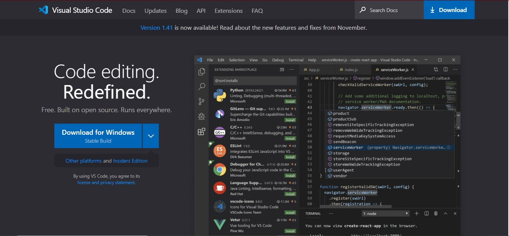

**2.** Para iniciar la descarga daremos click en el cuadro azul. 

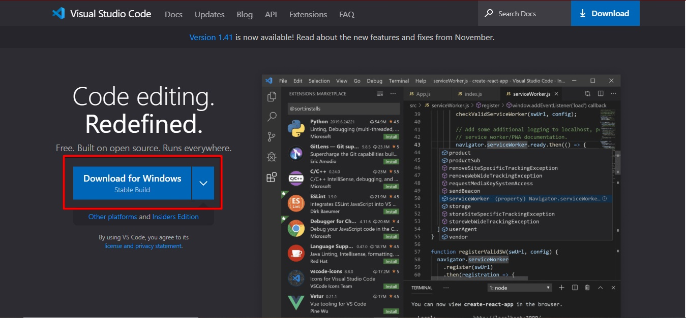

+ *Si el sistema operativo que apareceré en un inicio no es acorde al tuyo, da click en la flecha blanca para que despliegue las otras opciones de descarga y selecciona la que necesites.*

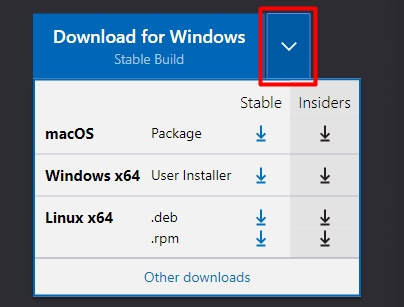

**3.** Una vez iniciada la descarga, aparecerá el siguiente mensaje:

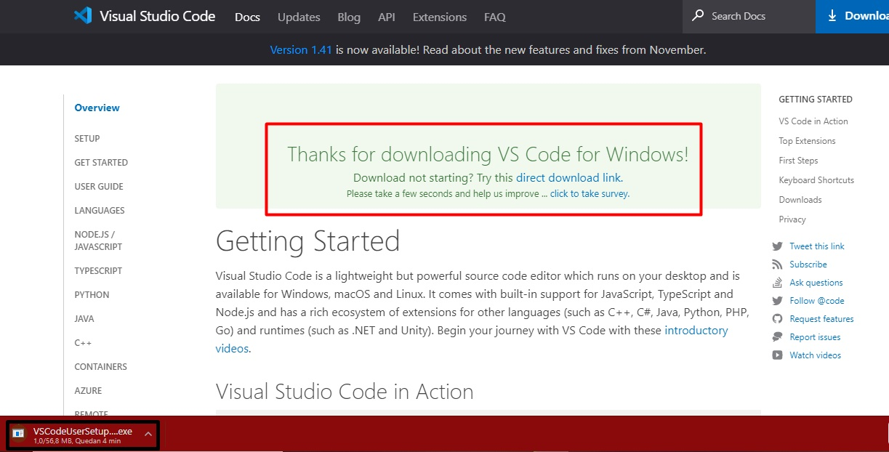

+ Lo señalado en rojo es un agradecimiento por haber descargado Visual Studio Code. En la parte inferior izquierda vemos que aparece el progreso de la descarga, el cual tendremos que esperar a que finalice para iniciar con la instalación. 

**4.** Ya que se ha descargado y hemos dado click para instalar, aparecerá un cuadro como el siguiente:

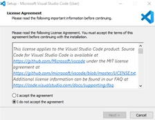

**5.** Daremos click en **I accept the agreement** y luego en **Next >** para continuar con la instalación. Tal y como está señalado en la imagen siguiente:

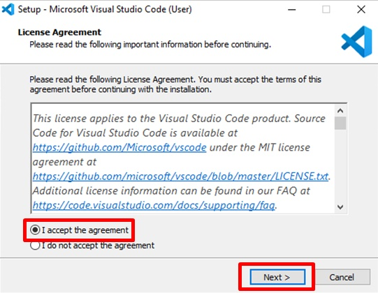

**6.** Posterior a ello nos mostrará lo siguiente:

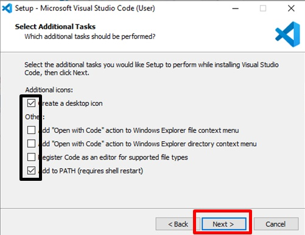

+ Lo marcado en negro son las opciones adicionales que nos da para instalar. En este caso asi lo dejaremos, sin embargo, si quiere anexar alguna solo da click en los cuadros que se encuentran a lado de las opciones. Por último daremos click en **Next >** (subrayado en rojo).

**7.** Después saldrá lo siguiente:

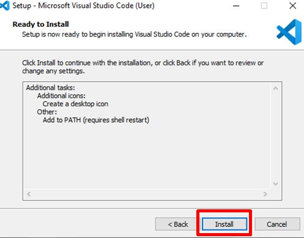

-Daremos click en **Install** para que comience a instalarse el programa.

**8.** Aparecerá una barra de progreso la cual deberemos de esperar a que se llene para poder finalizar con la instalación.

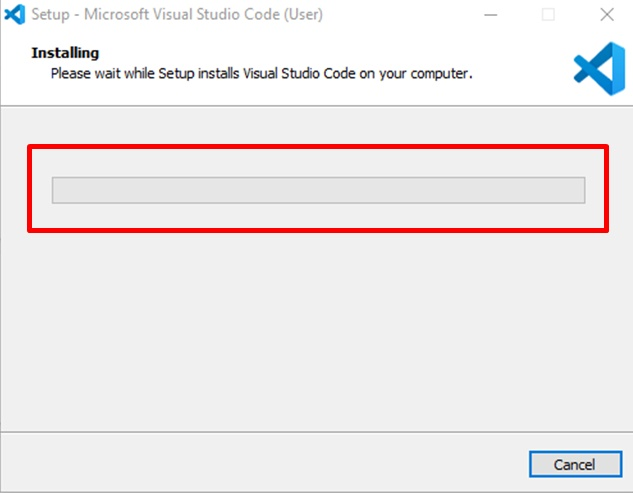

**9.** Por último, saldrá el siguiente mensaje de que la instalación ha finalizado y con ello ya podemos comenzar a usar Visual Studio Code. Ahora solo abra que dar click en **Finish**

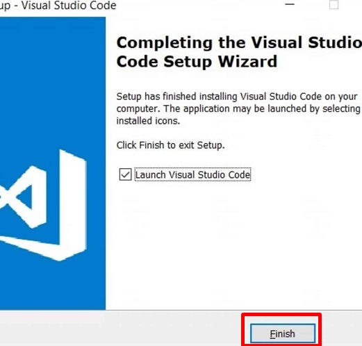

**10.** Ahora iremos al escritorio y podremos ver el icono de Visual Studio Code, solo daremos click y el programa se abrirá para poder usarse.

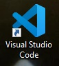

**Añadir C# para trabajar con el**

**1.** Para agregar C# a Visual Studio Code instalaremos la extensión del mismo.
Link de descarga desde la web: [C#](https://marketplace.visualstudio.com/items?itemName=ms-vscode.csharp)

-La página se visualizará de la siguiente manera:

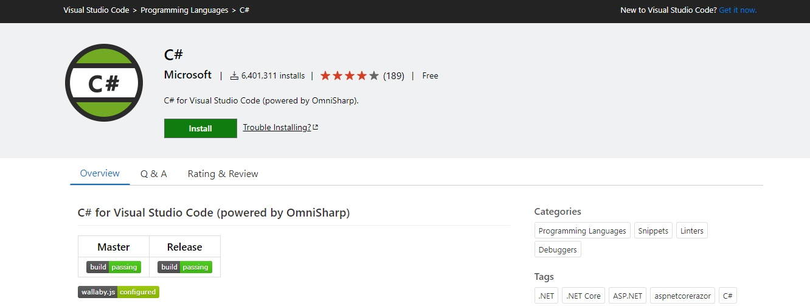

**2.** Daremos click en **Install** para descargar.

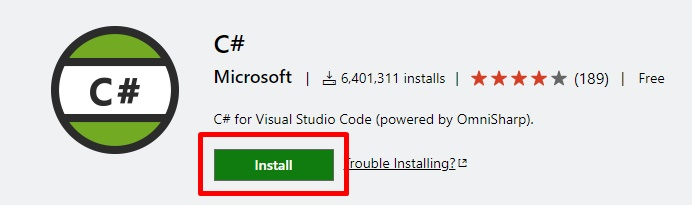

**3.** Después nos aparecerá la siguiente ventana emergente en la cual pedirá como requisito tener instalado VisualSC. Pulsamos el botón **Abrir Visual Studio Code**

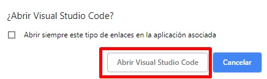

**4.** Se abrirá VisualSC, aparecerá la extensión y únicamente deberemos de pulsar **Install** para comenzar.

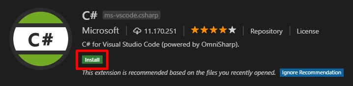

**5.** Ya que termine la instalación habrá que dar click en el botón de recarga para pode recargar el IDE.

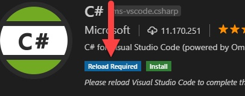

Con esto ya tendríamos nuestro entorno de Visual Studio Code listo para poder trabajar empleando C#. 

**Nota:** .Net Core debe de estar instalado también para Visual Studio Code para asi trabajar tanto con C# como con .Net Core

## Instalación de git. conectado a tu cuenta de GitHub y VSC.

**1.** Para descargar git es necesario ingresar al siguiente link:
[Git](https://git-scm.com/)

-Una vez ahí visualizaremos la siguiente página:

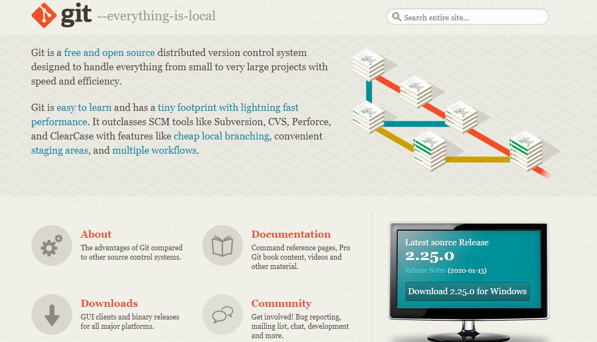

**2.** Nos dirigiremos a donde esta el ordenador y daremos click en **Download** para dar inicio con la descarga.

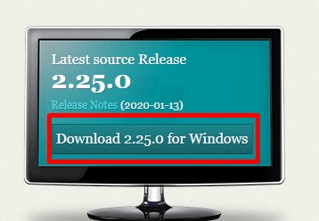

**3.** Una vez que inicie nos aparecerá lo siguiente y en la esquina inferior izquierda podremos ver el progreso de la descarga.

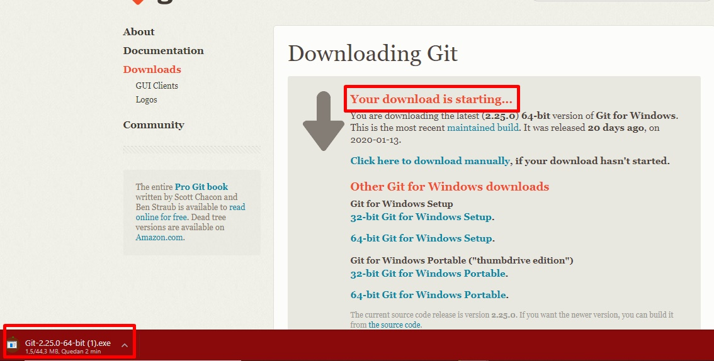

**4.** Ya finalizada la descarga, procederemos a abrir el archivo y se nos generará el siguiente recuadro:

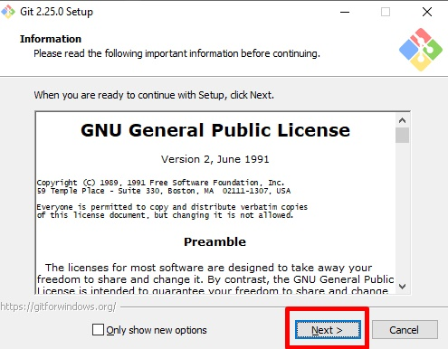

Aquí daremos click en **Next >** y nos aparecerá lo siguiente donde igual daremos click en **Next >**

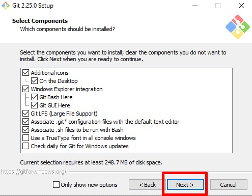

**5.** En este paso debemos de verificar que diga **Visual Studio Code**. En caso de que dijera alguna otra cosa, desplegamos las opciones y seleccionamos la que indique Visual Studio Code como se muestra en la imagen. Posteriormente damos click en **Next >**

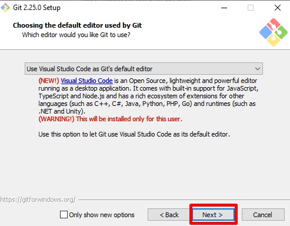

**6.** Continuaremos dando click en **Next >** en los campos siguientes.
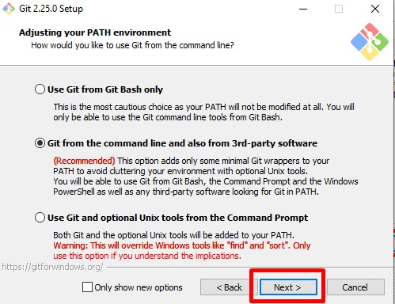
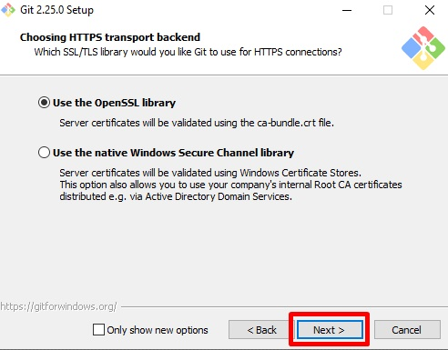
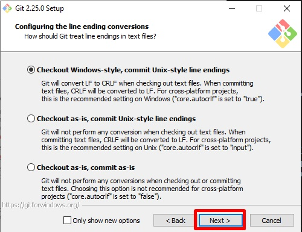
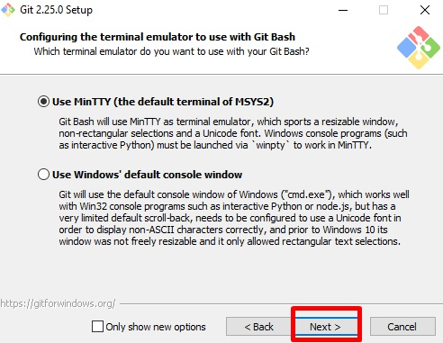

**7.** Daremos click en **Install** para que comiencé con el progreso y se finalicé la instalación.

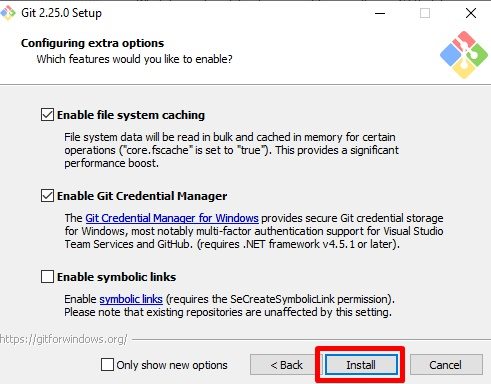

**8.** Un vez llegado aquí esperaremos a que se termine el progreso de intalación para poder usar git y al final daremos en **Finish**.

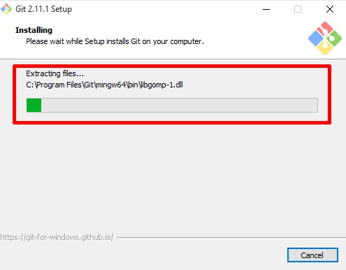
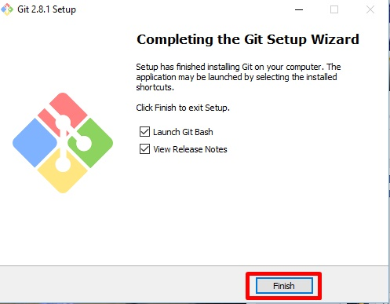

## Instalaciones completadas, esperemos te haya sido de utilidad. Gracias por la atención.

