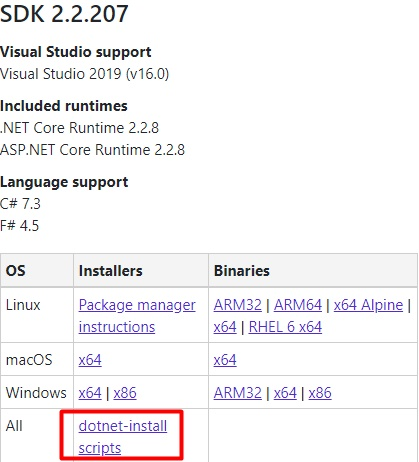

# **Ejercicio de Markdown en Github**

Datos del creador: López Rivera Vanessa Elizabeth

## Instalación de dotnet core 2.2.

1.Para la instalación de dotnet core 2.2 debes de dirigirte al siguiente link para poder . 

Link a la página de descarga: [Download](https://dotnet.microsoft.com/download/dotnet-core/2.2) 

Cuando ingreses a la página de descarga podrás visualizar algo como lo siguiente:

2.Una vez en el sitio deberás de bajar con el curso 

Nota: Es impotante bajar el SDK, por que **vamos a programar**.

## Instalación y configuración de Visual Studio Code para C#.

## Instalación de git. conectado a tu cuenta de GitHub y VSC.
